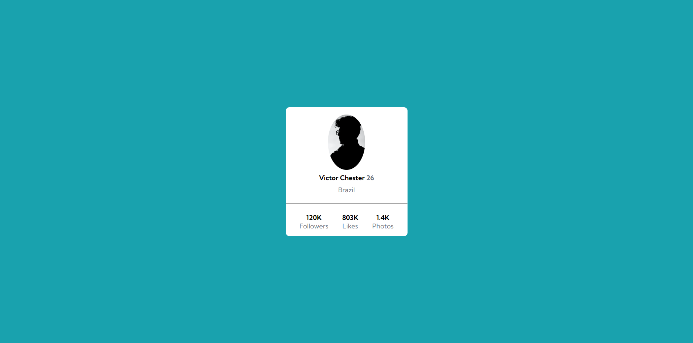
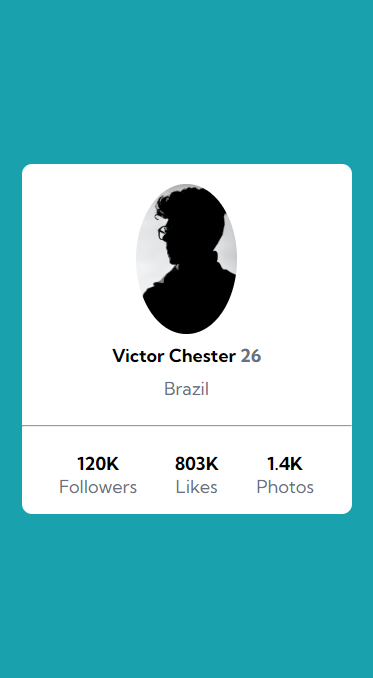

# Profile card component solution
- Frontend Mentor project, created as an activity in the Dev Quest course, to test and practice knowledge in HTML, CSS and positioning with CSS Flexbox.

## Table of contents

  - [The challenge](#the-challenge)
  - [Screenshot](#screenshot)
  - [My process](#my-process)
  - [Built with](#built-with)
  - [What I learned](#what-i-learned)
  - [Continued development](#continued-development)

### The challenge

- Build a card that contains profile information according to the designs provided.

### Screenshot

## My process

I had some difficulty with the centralization, especially of the container itself, but I managed to understand better when asking for help, and thus I was able to open my vision a little more and better study some semantics and organizations in the code.

### Built with

- Semantic HTML5 markup
- CSS custom properties
- Flexbox
- CSS Grid
- Mobile-first workflow

### What I learned

I had difficulties with centering the container and also maintaining the proportion of the project image, both in desktop and mobile form. But, by stopping to think about the problem and also searching through my study materials, it was possible to finish the project.

### Continued development

The project that was proposed made me realize that we must stop to think before solving a problem, always looking for other points of view.
